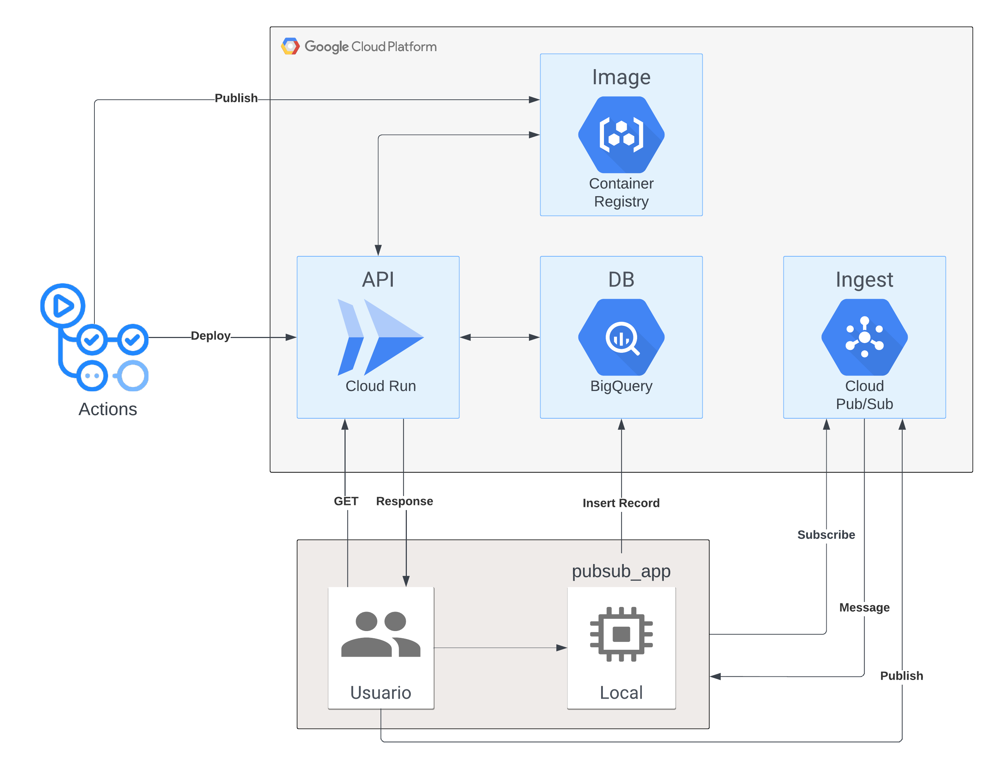

# LATAM Challenge DevSecOps/SRE

## Contexto
Se requiere un sistema para ingestar y almacenar datos en una DB con la finalidad de hacer
analítica avanzada. Posteriormente, los datos almacenados deben ser expuestos mediante
una API HTTP para que puedan ser consumidos por terceros.

## Objetivo
Desarrollar un sistema en la nube para ingestar, almacenar y exponer datos mediante el uso
de IaC y despliegue con flujos CI/CD. Hacer pruebas de calidad, monitoreo y alertas para
asegurar y monitorear la salud del sistema.

## Parte 1: Infraestructura e IaC

### 1. Servicios a utilizar
La infraestructura de la solución consta de tres partes: la ingesta de datos, el almacenamiento y la exposición de estos. Esta infraestructura utiliza los servicios de **Google Cloud Platform** (GCP).

1. Para la **ingesta de datos** se utiliza el servicio **Pub/Sub** de GCP. Este recibe los datos de diversas fuentes, para luego distribuirse hacia el servicio de almacenamiento y análisis. Pub/Sub permite manejar flujos de datos en tiempo real y de manera asincrónica y escalable, siendo ideal en estos escenarios en los que es necesario desacoplar la ingesta de datos del procesamiento.

2. El **almacenamiento y análisis de datos** se realiza mediante **BigQuery**. Este almacenará los datos ingeridos y proporcionará capacidad de análisis que podrá ser aprovechada por otras aplicaciones a través de consultas SQL. BigQuery almacena y analiza grandes volúmenes de datos sin necesidad de gestionar la infraestructura subyacente, lo que simplifica su manejo, pero sin dejar de lado el análsis avanzado de datos que se requiere.

Se utiliza unicamente un `dataset` con una única tabla para simplificar la posterior consulta con la API HTTP. Las columnas de la tabla son: un ID único, nombre, apellido y país. Siendo todos campos de tipo `string` y obligatorios.

3. Para **exponer los datos almacenados** mediante una API HTTP, se utiliza el servicio de **Cloud Run**. Este aloja la API que sirve los datos desde BigQuery, proporcionando un endpoint al que pueden consumir terceros. Al igual que BigQuery, Cloud Run es un servicio *serverless*, es decir que el *cloud provider*, en este caso GCP, se encargará de la gestíon del servidor, escalando automáticamente según la demanda y permitiendo que la API esté disponible y responda eficientemente las solicitudes sin gastar recursos innecesarios.

Se utiliza el servicio de **Container Registry** de GCP para almacenar la imágen de Docker de la API. De esta forma, la instancia de Cloud Run podrá utilizarla y crear el contenedor con la aplicación simplemente referenciando el repositorio y el nombre de la imágen.

### 2. Despliegue de infraestructura

Para el despliegue automático de estos servicios en GCP, se utiliza el software de *infrastructure as code* (IaC) **Terraform**.

El código se encuentra en el directorio `/terraform`, que contiene los servicios anteriormente mencionados, y la configuración básica para poder desplegarlos.

Para crear los recursos en un **entorno GCP ya existente**, primero es necesario autenticarse a la consola de Google Cloud. Para esto se utiliza el **archivo de credenciales** de una *service account*. Este método es seguro y fácil de implementar. Para ello se crea una *service account* manualmente en GCP, con los permisos necesarios para correr todos los servicios correspondientes. Luego se crea una JSON *key* dentro de esta cuenta, la cual se coloca en el directorio `/shared/config` con el nombre `gcp-cred.json`, y de esta forma Terraform conectará la cuenta de GCP correctamente.

Este archivo JSON no es incluido en el control de versiones, por los riesgos de seguridad que conlleva tener datos sensibles que permitan el acceso a la cuenta de Google Cloud.

Por el mismo motivo, no se cuenta con el archivo `terraform.tfvars` que indica a Terraform el valor de las variables que debe utilizar. Para facilitar la ejecución, se creó el archivo `terraforn.tfvars.example` dentro del directorio `/terraform`, que indica que variables hay que *setear*, y un valor de ejemplo para cada una de ellas. Para ejecutar el código, simplemente se deben cambiar los valores del archivo de ejemplo y renombrarlo a `terraform.tfvars`.

Una vez resuelto estas dos últimas cuestiones, se procede a inicializar el directorio de trabajo de Terraform, en el propio directorio `/terraform`:
```
terraform init
 ```
 
Luego se crea el plan de ejecución:
```
terraform plan
```

Y por último se aplican los cambios para alcanzar el estado deseado de la infraestructura:
```
terraform apply
```

## Parte 2: Aplicaciones y flujo CI/CD

### 1. Aplicación API HTTP

La **API HTTP** tiene como propósito exponer los datos almacenados en BigQuery a través de los endpoints de esta. Como se mencionó anteriormente, la API es desplegada en Google Cloud Run, permitiendo que escale según la demanda y optimizando el uso de recursos. También puede ser ejecutada de manera local, siguiendo los pasos de este [README.md](./api/app/README.app).

La **estructura de la aplicación** está organizada de manera que cada componente de la API esté claramente delimitado:

- `app/`: Contiene la aplicación principal, con submódulos organizados para manejar las rutas, la lógica de negocio, y la interacción con la base de datos.
    - `routes.py`: Define los endpoints de la API y maneja las solicitudes HTTP.
    - `bigquery_handler.py`: Contiene la lógica para interactuar con BigQuery, incluyendo funciones para ejecutar consultas SQL y manejar los datos devueltos.

- `config/`: Almacena la configuración de la API, incluyendo las credenciales necesarias para interactuar con los servicios de GCP y las variables de entorno.

- `test/test_data`: Contiene el script para poblar la base de datos de BigQuery.
    - `mock_data.py`: Script para poblar la base de datos en GCP y así probar los endpoints definidos anteriormente. Utiliza la bilbioteca `Faker` para crear datos ficticios realistas.

La aplicación cuenta con varios endpoints que permiten realizar lecturas en la base de datos, exponiendo los datos de esta al recibir una petición GET. Para esto se desarrollaron los siguientes endpoints:

- **GET /records**: Este endpoint permite obtener un conjunto de registros de la base de datos de BigQuery. Soporta paginación mediante los parámetros `limit` y `offset`, permitiendo controlar la cantidad de registros devueltos y la posición desde la cual se empiezan a contar los registros.

 - **GET /records/<id>**: Este endpoint permite obtener un único registro basado en el `ID` proporcionado en la URL.


La API se desarrolló utilizando el framework de **Flask** de Python, facilitando así la creación de la aplicación web necesaria para exponer los datos. Se emplearon *blueprints* para modularizar el código, separando la lógica de la API en distintas partes, lo que facilita el mantenimiento y permite ampliar los métodos fácilmente en un futuro.

Para leer datos desde BigQuery, se implementó el método `execute_query` en el módulo `bigquery_handler.py` que ejecuta consultas SQL utilizando el cliente oficial de Google Cloud para Python (`google-cloud-bigquery`). Los resultados de las consultas se transforman en listas de diccionarios para facilitar su serialización y posterior envío como respuesta a las solicitudes HTTP.

### 2. Despliegue de la API HTTP

Para desplegar la aplicación en la nube, esepcificamente en el servicio de Google Cloud Run, se utiliza un workflow de **GitHub Actions** . Para facilitar esta tarea, se utilizan dos acciones que permiten la construcción y publicación de la imagen de Docker a un registro, para su posterior despliegue en GCP. Estas acciones son `push-to-gcr-github-action` y `deploy-cloudrun`. La utilización de estas acciones, en lugar de por ejemplo utilizar el paso `run`, permite abstraer la lógica de los pasos que realiza y así mejorar la comprensión y el mantenimiento del *workflow*.

En *workflow* tambíen se realiza la creación de archivos con datos sensibles, que luego serán necesarios en la API. Se trata por ejemplo de los archivos `gcp_cred.json` y `gcp_vars.json`, que contiene la información para autenticarse a GCP y los nombres y valores de los servicios de GCP respectivamente. Para esto se utilizan los **GitHub Secrets** para *GitHub Actions*. Estos son variables que se crean a nivel repositorio, que contienen información sensible, y que luego pueden ser referenciados en el *workflow* para que al momento de ejecutarse, sea reemplazado por el valor seteado.

La publicación de la imágen se realiza a un repositorio de **Google Container Registry**, la cual es luego utilizada por la instancia de Cloud Run y que de esta forma pueda crear el contenedor y ejecutar la API. El repositorio es creado una vez se sube la primera imágen con el workflow de Actions, indicando el nombre de este en la [acción](https://github.com/TomasAMolinari/tu-latam-challenge/blob/88d32c2f39e8f61dd37219cef34a8b5cc5799f94/.github/workflows/deploy.yml#L36). La imágen que la instancia de Cloud Run utiliza, se indica en el [código](https://github.com/TomasAMolinari/tu-latam-challenge/blob/88d32c2f39e8f61dd37219cef34a8b5cc5799f94/terraform/modules/cloudrun/main.tf#L9) de Terraform, junto con el resto de configuración de este servicio.

Con este código de Terraform, se desplegó la instancia de CloudRun, la cual a su vez corre la imágen de Docker publicada y desplegada por el *workflow*. La **URL de la instancia** es `https://data-api-service-vgf42mneka-uc.a.run.app`. Por lo tanto se puede probar la API, por ejemplo con la siguiente consulta: 
`https://data-api-service-vgf42mneka-uc.a.run.app/records/12345`

Obteniendo como respuesta el siguiente JSON:
```
{
  "apellido": "Perez",
  "id": "12345",
  "nombre": "Juan",
  "pais": "Argentina"
}
```

### 3. Ingesta de datos mediante Pub/Sub

Para la **ingesta de datos** se utiliza una aplicación en Python, la cual escucha continuamente a la suscripición del tópico de Google Pub/Sub, esperando a recibir un mensaje. Una vez recibido este mensaje, se ejecuta un [callback](https://github.com/TomasAMolinari/tu-latam-challenge/blob/f847594e3ea7b51e6d769e30af7764e27e677af0/pubsub_app/gcp_handler/pubsub_handler.py#L24-L45) para insertar el contenido en la base de datos de BigQuery.

La aplicación se ejecuta de forma local, siguiendo los pasos de este [README.md](https://github.com/TomasAMolinari/tu-latam-challenge/blob/development/pubsub_app/README.md).

Internamente, la función realiza la validación para insertar aquellos registros que contengan todos los campos necesarios. Si la información del mensaje no es correcta u ocurre algún error en el procesamiento, entonces se vuelve a intentar hasta llegar al número de intentos máximos dado en el [código](https://github.com/TomasAMolinari/tu-latam-challenge/blob/f847594e3ea7b51e6d769e30af7764e27e677af0/terraform/modules/pubsub/main.tf#L20) de Terraform. Si llega a la cantidad de intentos máximas, entonces se enviará el mensaje a otro tópico de Pub/Sub, utilizando la política de *deadman letter*.

### 4. Diagrama de Arquitectura

El siguiente **diagrama de arquitectura** es una representación a alto nivel de todas las interacciones del sistema, partiendo desde el momento en donde se publica la imágen de la API en Container Registry mediante el workflow de *GitHub Actions*, para luego ser utilizada por la instancia de Cloud Run, la cual recibe solicitudes de un usuario y le responde con los datos de BigQuery. A su vez el usuario publica mensajes en formato JSON al tópico de Pub/Sub, al cual se suscribe la aplicación de PubSub que es ejecutada por el usuario, y que al recibir los mensajes de este servicio, inserta la información en BigQuery.



## Parte 3: Pruebas de Integración y Puntos Críticos de Calidad
